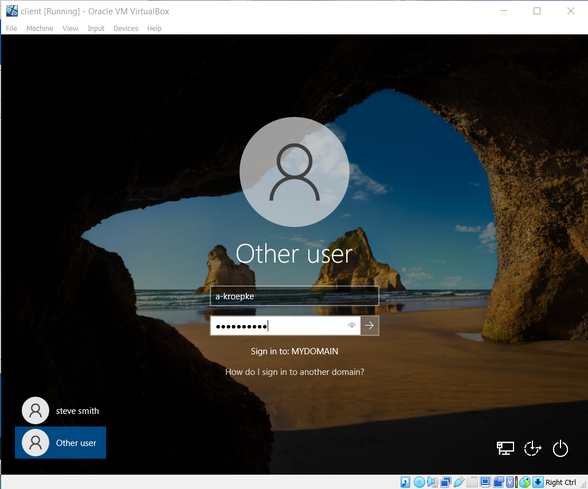
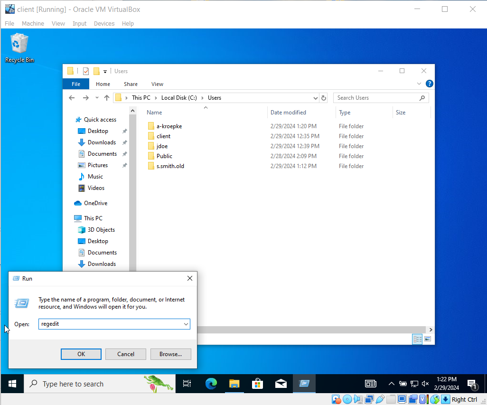
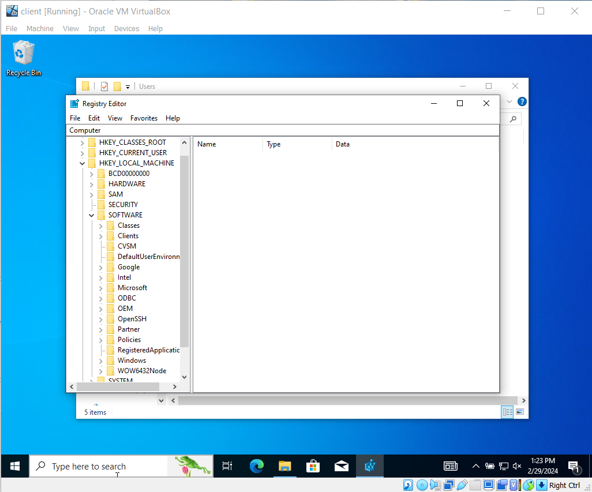
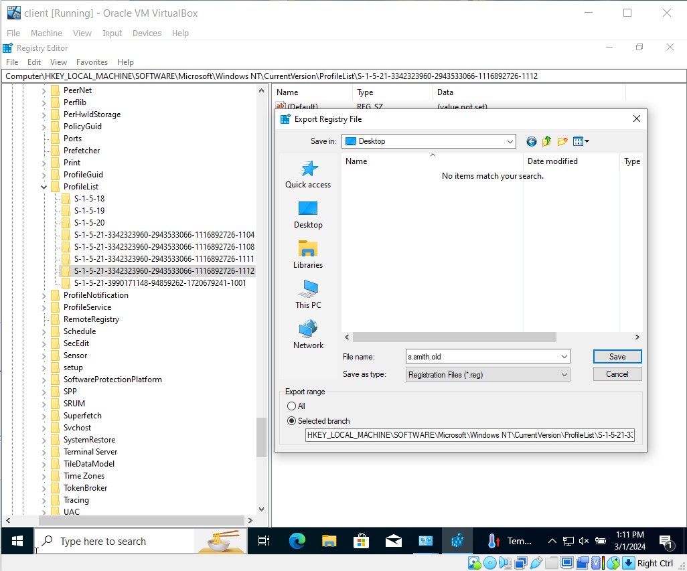
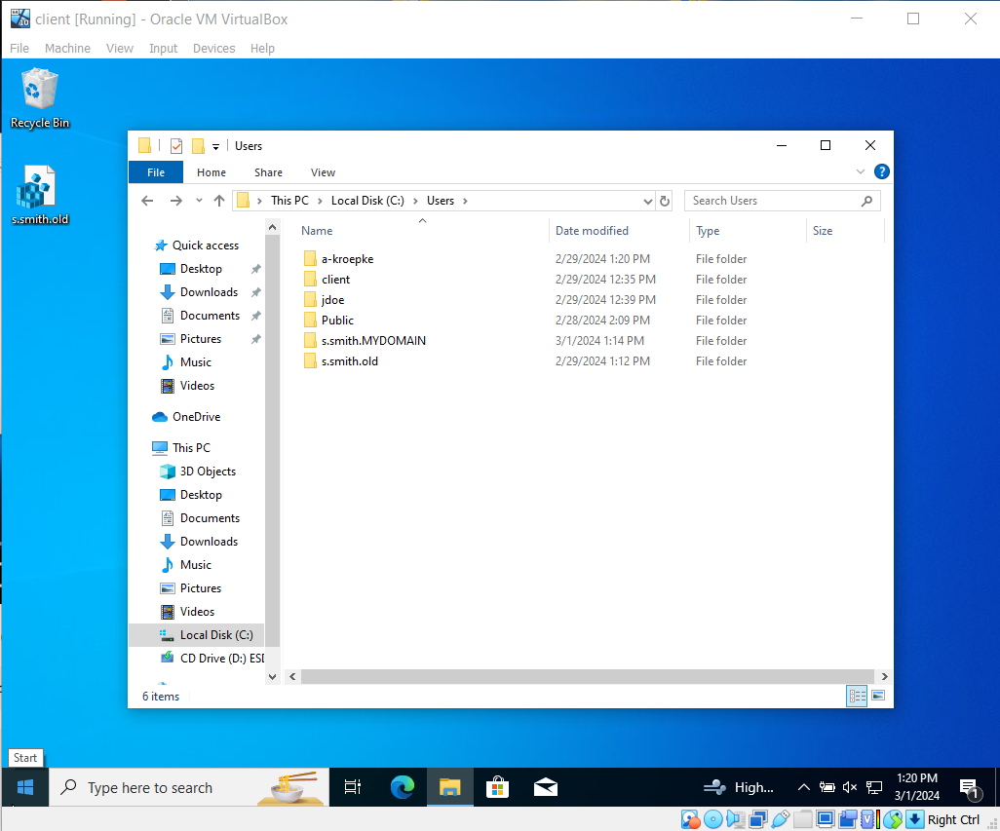
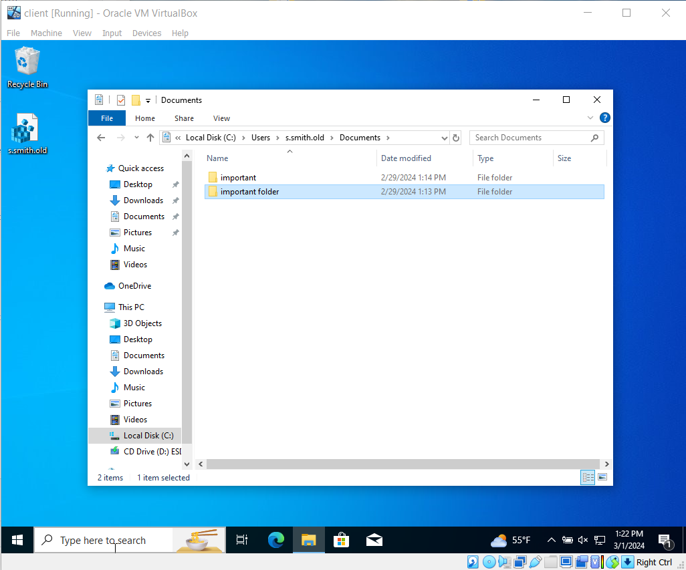

<h1>Corrupted profile rebuild</h1>

 

<h2>Description</h2>
In this project i explain the process of rebuilding a corropted windows profile and transffering important files to  the new profile. 
 

<h2>Utilities Used</h2>

- <b>Windows Registry</b> 
- <b>File Explorer</b>
- <b>Control Panel</b>

<h2>Environments Used </h2>

- <b>Virtual Box</b> (21H2)
- <b>Windows 10 pro</b> (21H2)
- <b></b> (21H2)

<h2>Program walk-through:</h2>

log onto the clients computer with administrative account.

Go into the c drive go to users find the affected profile and change the name to old.

Go to the windows registry by typing run and regedit.

Go to local system, software, microsoft, windows nt, current version, profile list.

Next find the security identifier and export it to your desktop and delete the key in the registy.

 
 Next log out of the administrator acount and, log back in the the  users account.Windows will rebuild the profile

  
  <!--Windows will rebuid the profile.
 -->
  
  After the account is rebuilt log in with admin account and,find the old user account in the c drive.

  
  Transfer needed files to the new user profile.

  
  Finaly log back into the user profile.

