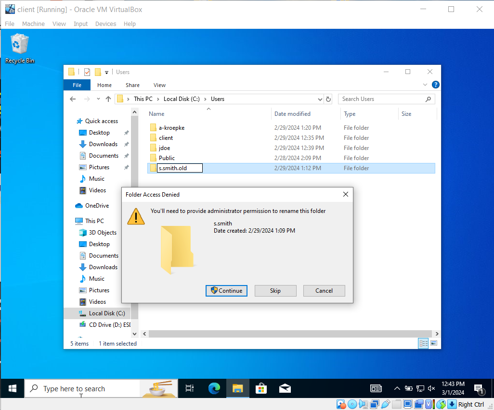
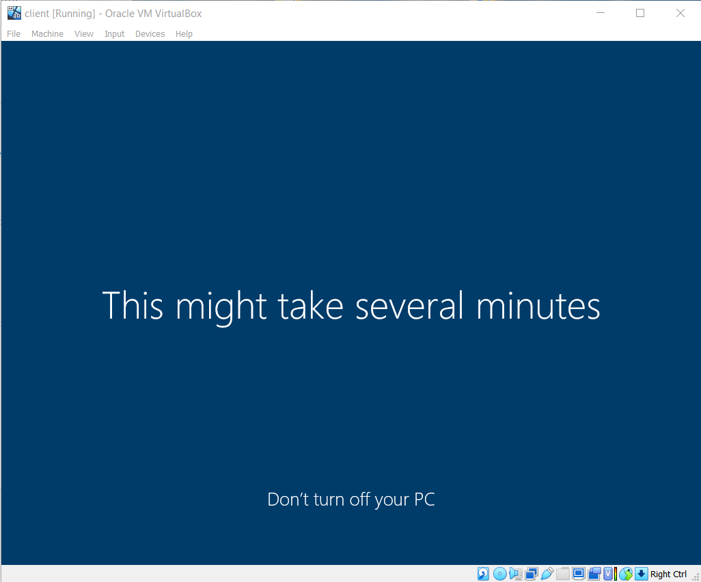
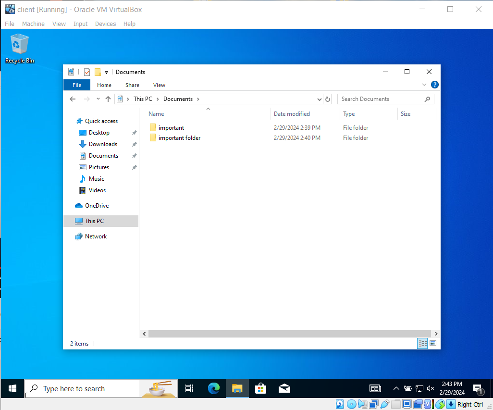

<h1>Corrupted profile rebuild</h1>

 

<h2>Description</h2>
This repository explain's the process of rebuilding a corrupted windows profile and transffering important files to the new profile.I use the file explorer to find the user profile and, rename it. Next i access the windows registry to delete the user key so windows can rebuid the profile and, finally transfer important files by going to Users in the file explorer.
 

<h2>Utilities Used</h2>

- <b>Windows Registry</b> 
- <b>File Explorer</b>
- <b>Control Panel</b>

<h2>Environments Used </h2>

- <b>Virtual Box</b> (21H2)
- <b>Windows 10 pro</b> (21H2)

<h2>Program walk-through:</h2>

First log onto the clients computer with an administrative account.

Next go into the c drive go to users find the affected profile and change the name to old.

Go to the windows registry by typing run and regedit.

After that go to local system, software, microsoft, windows nt, current version, profile list.

Go find the security identifier and export it to your desktop and delete the key in the registy.

 
 Next log out of the administrator acount and, log back in the the users account and, windows will rebuild the profile.

  
  <!--Windows will rebuid the profile.
 -->
  
  After the account is rebuilt log in with admin account and,find the old user account in the c drive.

  
  Next Transfer needed files to the new user profile by going to file explorer, c drive, users.

  
  Finaly log back into the rebuilt profile.

